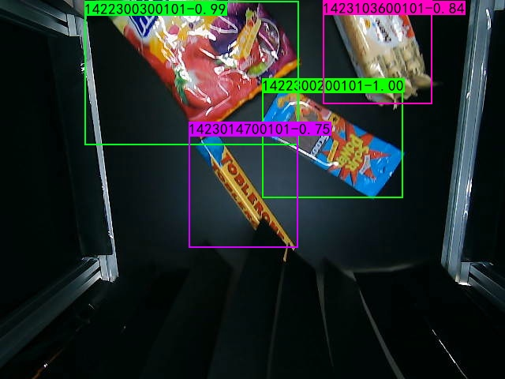
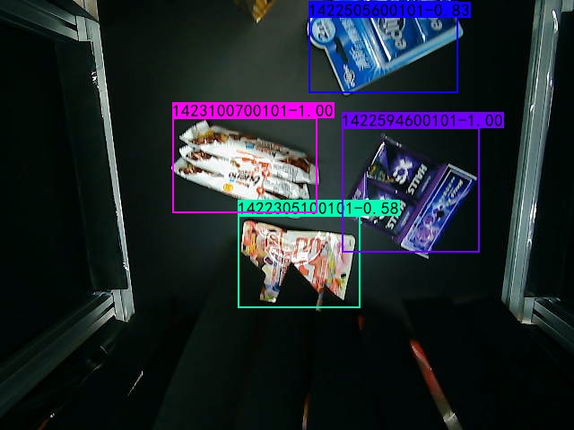
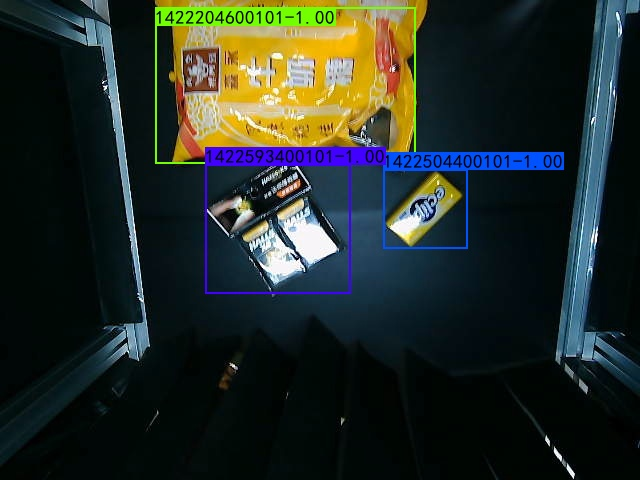
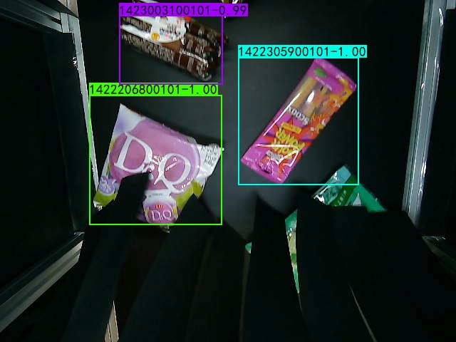
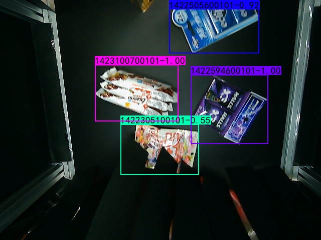
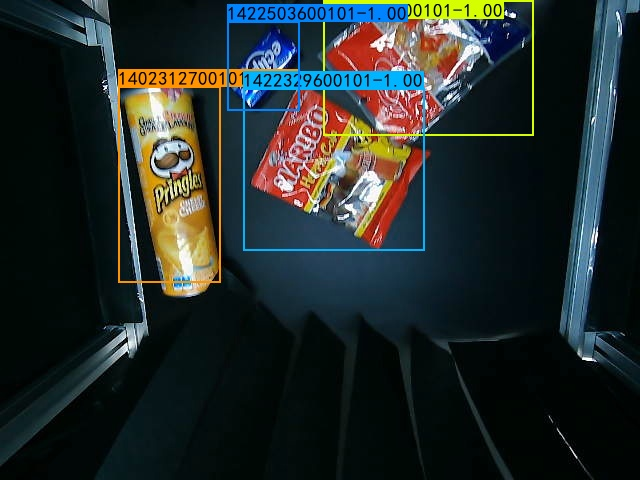
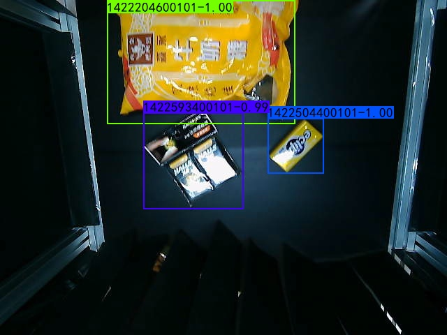
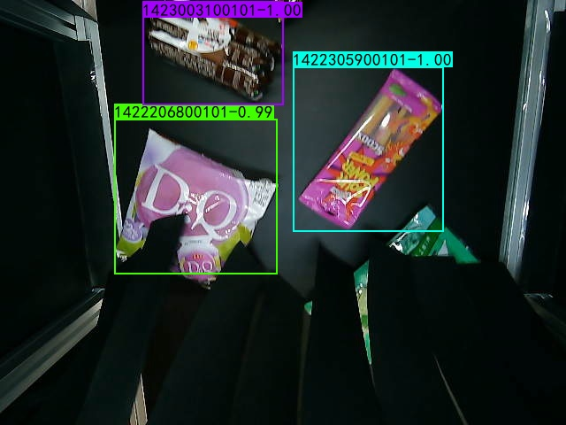

# Auto-Checkout-Edge-Computing-System

I combine ShuffleNet and MobileNet that name is Shuffle MobileNet  
I used two object detection architecture, SSD and YoloV3, respectively.  


### Weights and Dataset
If you want to use myself training weights and datasets, you can use link to .  


### Execute YoloV3 Shuffle MobileNet


### Execute YoloV3


### Execute YoloV3 Shuffle MobileNet
<div>
    
    
    
    
    
</div>


### Execute YoloV3
<div>
    
    
    
    
    
</div>


### Requriments
I use tensorflow2 implenment.
```
pip install -r requirments.txt
```

### Train
Step 1: Modify `config.py`  
```
    EPOCHS : The number of iteration. 
    BATCH_SIZE: You can modify size, according to your GPU.

    CLASSES: You want to train classes.
    
    DATASET : Dataset path
    VOC_TEXT_FILE: Dataset train, val, test images information.
    VOC_TRAIN_FILE: Produce train text file.

    MODEL_FOLDER : Stroage weigth folder
    FILE_NAME : Storage weigth weight
```
Step 2: `python voc_annotation.py`
You can obtain three text files(train.txt, val.txt and test.txt)  

### Test
If you want to predict image, please use
```python predict.py```  
Use video
```python video.py```

### Evalutate SSD model
Step 1: You need use `python predict_text.py` produce predicted results' text file.  
Step 2: `python evaluate.py`(SSD Folder)

### Evalutate YOLOV3 model
Modify the `evaluate.py` load weigth path, you can evaluate yourself model.   
`python evaluate.py`(YOLO V3 Folder)  


### Reference
[Mobilenet-SSD-Essay](https://github.com/bubbliiiing/Mobilenet-SSD-Essay)  
[MobileNets: Efficient Convolutional Neural Networks for Mobile Vision Applications](https://arxiv.org/abs/1704.04861)  
[MobileNetV2: Inverted Residuals and Linear Bottlenecks](https://arxiv.org/abs/1801.04381)  
[Searching for MobileNetV3](https://arxiv.org/abs/1905.02244)
[yolo3-keras](https://github.com/bubbliiiing/yolo3-keras)  
